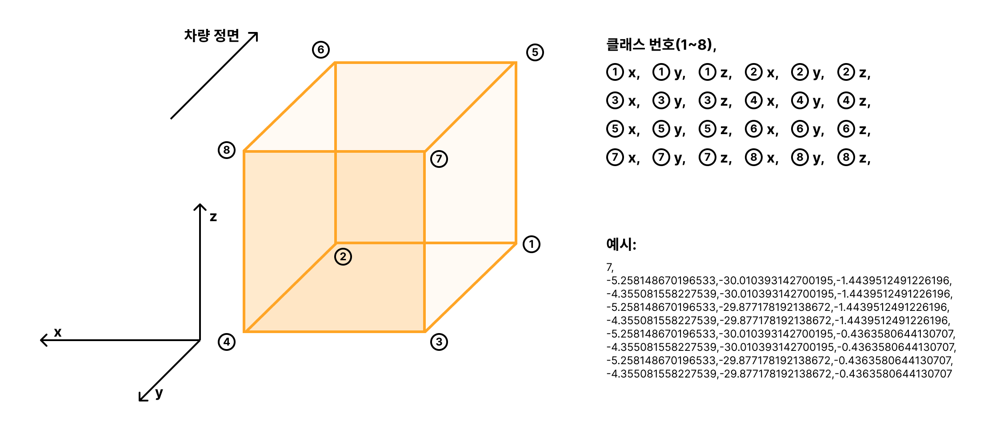
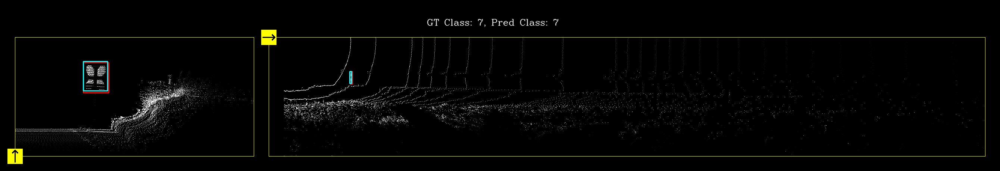
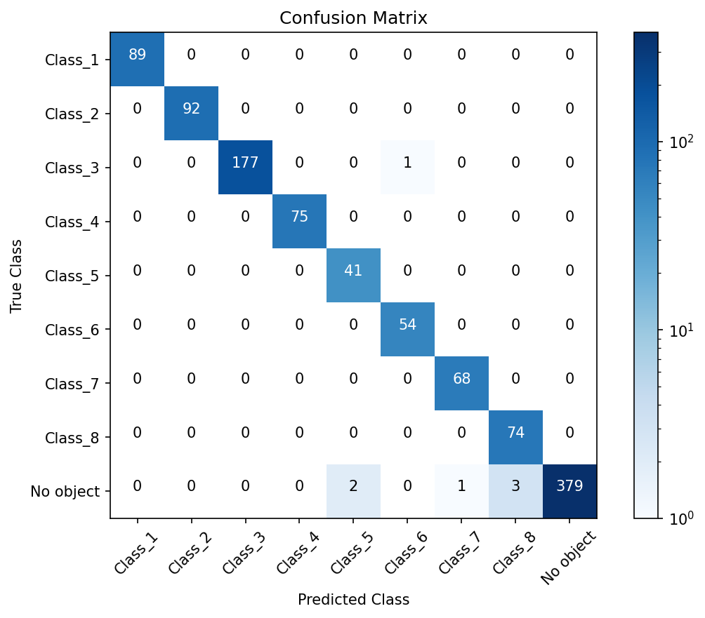
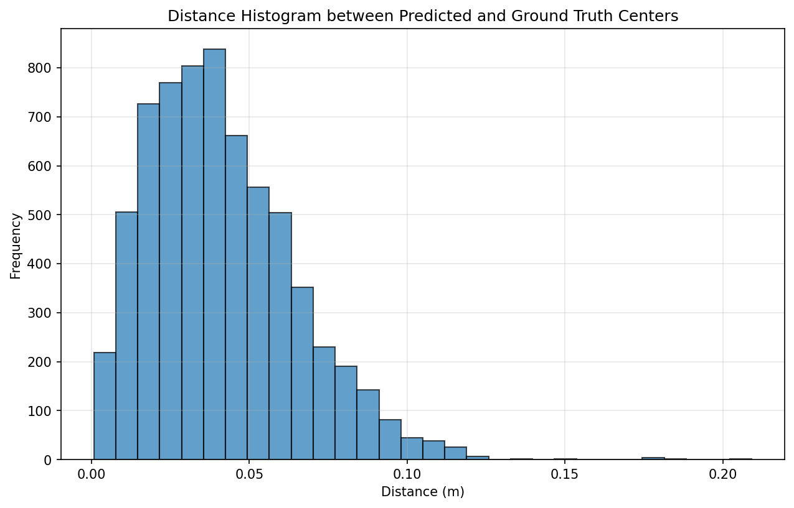
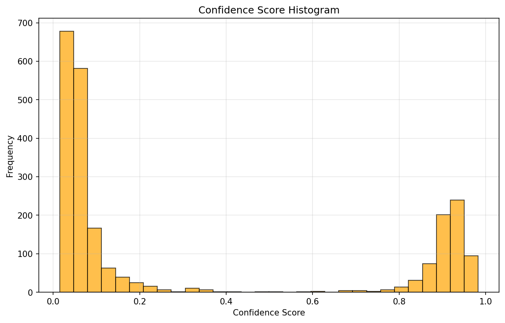

# Roadsign Detector

> 모델 논문: [PointPillars: Fast Encoders for Object Detection from Point Clouds](https://openaccess.thecvf.com/content_CVPR_2019/papers/Lang_PointPillars_Fast_Encoders_for_Object_Detection_From_Point_Clouds_CVPR_2019_paper.pdf)

## 개발 환경

아래 환경은 개발에 사용한 환경이며, 필수적인 환경은 아닙니다. 모델 학습 시에는 적당한 버전의 Python과 CUDA 코드를 돌릴 수 있는 GPU, 모델 평가 시에는 Python만 있어도 됩니다.

- Ubuntu 20.04.6 LTS (64-bit)
- 12th Gen Intel® Core™ i7-12700 × 20
- NVIDIA GeForce RTX 3070/PCIe/SSE2
- Python 3.8.20
- CUDA 12.8

## 학습/평가 전 준비 과정

### 1. 필수 패키지 설치

> [Anaconda](https://www.anaconda.com/docs/getting-started/anaconda/install)와 같은 가상환경 도구를 사용하는 것을 추천합니다.

```bash
pip install -r requirements.txt
```

아래 코드를 가상환경 터미널에 붙여넣기를 해 설치 여부를 확인하실 수 있습니다.

```bash
python -c "import pytorch_lightning as pl, torch, hydra, rootutils, rich, tensorboard, spconv, cv2, matplotlib, numba, open3d as o3d, onnx, onnxruntime as ort, onnxsim, onnx_graphsurgeon as gs; print(f'PyTorch Lightning: {pl.__version__} \nPyTorch: {torch.__version__} \nCUDA available: {torch.cuda.is_available()} \nHydra: {hydra.__version__} \ntensorboard: {tensorboard.__version__} \nspconv: {spconv.__version__} \nOpenCV: {cv2.__version__} \nmatplotlib: {matplotlib.__version__} \nnumba: {numba.__version__} \nopen3d: {o3d.__version__} \nonnx: {onnx.__version__} \nonnxruntime: {ort.__version__} \nonnxsim: {onnxsim.__version__} \nonnx_graphsurgeon: {gs.__version__}')"
```

아래처럼 각 모듈의 버전이 정상적으로 나온다면 성공입니다. (버전이 조금씩 다르더라도 괜찮습니다.)

```
PyTorch Lightning: 2.4.0 
PyTorch: 2.4.1+cu121 
CUDA available: True 
Hydra: 1.3.2 
tensorboard: 2.14.0 
spconv: 2.3.6 
OpenCV: 4.5.5 
matplotlib: 3.6.3 
numba: 0.58.1 
open3d: 0.14.1 
onnx: 1.17.0 
onnxruntime: 1.19.2 
onnxsim: 0.4.36 
onnx_graphsurgeon: 0.5.8
```

> CUDA available이 False라면 모델 평가만 진행할 수 있습니다.

## 모델 학습하기

> 모델 학습을 새로하지 않고, 보유한 체크포인트 파일이 있다면 바로 평가하기를 진행할 수 있습니다. `checkpoints/best.ckpt`에 가장 결과가 잘 나왔던 체크포인트를 저장해두었습니다.

### 1. 학습데이터 만들기

아래처럼 dataset이 있다고 가정합니다. `.pcd` 파일과, 라벨 데이터 파일 (`.txt`)이 같은 폴더에 들어있는 환경을 가정하고 있습니다.

```
/home/rideflux/LIDAR_DATA
├── 10_binary
│   ├── 123_1.1m.pcd
│   ├── 123_1.1m.txt
│   └── ...
├── 11_binary
│   ├── 123_1.1m.pcd
│   ├── 123_1.1m.txt
│   └── ... 
├── 12_binary
│   ├── 123_1.1m.pcd
│   ├── 123_1.1m.txt
│   └── ... 
```

라벨 데이터의 구성은 다음 그림을 따릅니다.




[collect_pcd_data.py](./collect_pcd_data.py)를 수정하여 데이터셋이 있는 폴더를 지정합니다. 본 스크립트는 해당 폴더 하위(중첩 폴더 포함)의 모든 `.pcd` 파일을 수집하므로, 최상단의 폴더 이름으로 수정하면 됩니다. 

위 예시 기준으로는 아래와 같이 수정하시면 됩니다.
```py
# collect_pcd_data.py
root_dir = '/home/rideflux/LIDAR_DATA'
...
```

> `~`(Home 디렉터리)는 사용할 수 없으므로, 해당 데이터 폴더의 전체 절대경로를 입력해 주셔야 합니다.

수정 후 다음을 실행합니다.

```bash
python collect_pcd_data.py
```

실행 후 지정한 폴더 아래에 

- `train_set.pkl` : 표지판 데이터 전체의 80% + 표지판 데이터 전후반전 10% + FP 데이터 10%의 80% 
- `val_set.pkl` : 표지판 데이터 전체의 20% + 표지판 데이터 전후반전 10% + FP 데이터 10%의 20%
- `test1_set.pkl` : val_set.pkl과 동일
- `test2_set.pkl` : 표지판 데이터 전체의 20% + 표지판 데이터 전후반전 20% + FP 데이터 10%의 20%
- `test3_set.pkl` : 표지판 데이터 전체의 20% + 표지판 데이터 전후반전 10% + 모든 FP 데이터

와 같은 파일들이 생겼다면 성공입니다.

```
/home/rideflux/LIDAR_DATA
├── 10_binary
│   ├── 123_1.1m.pcd
│   └── ... 
├── 11_binary
│   ├── 123_1.1m.pcd
│   └── ... 
├── 12_binary
│   ├── 123_1.1m.pcd
│   └── ... 
├── train_set.pkl
├── val_set.pkl
├── test1_set.pkl
├── test2_set.pkl
└── test3_set.pkl
```

### 2. config 수정하기

다음으로, [pcd.yaml](./configs/data/datasets/pcd.yaml)을 수정합니다. 

학습데이터 만들기에서 사용한 폴더명을 그대로 사용하시면 됩니다.

```yaml
dataset_root_dir: /home/rideflux/LIDAR_DATA
```

### 3. 학습하기

아래 명령을 입력하여 학습을 시작합니다.

```bash
python train.py
```

기본적으로 epoch은 총 500번 돌게 되어있으며, 최소 20번의 epoch 실행 후 더 이상 성능 개선이 이뤄지지 않는다면 멈추게 되어있습니다. (제공해 주신 데이터 기준으로 약 22번 실행 후 종료되었습니다.)

> Processing train data <span style="color:#f92672;">━━━━━━━━━━━━━━━━━━━━━━━━━━━━━━━━━━━━━━━━</span> 100% 0:00:10  
> train dataset size : 9078  
> Processing val data <span style="color:#f92672;">━━━━━━━━━━━━━━━━━━━━━━━━━━━━╸</span>━━━━━━━━━━━  72% 0:00:01


위 과정이 종료된 후, 

> Epoch 0/499 <span style="color:#6022DB;">━━</span>╺━━━━━━━━━━━━━━━━━━━━━ 48/568 0:00:21 • 0:03:55 2.21it/s

이런 모양이 뜨면 성공이며, 학습 완료 후 체크포인트 파일은 `outputs/yyyy-MM-dd/HH-mm-ss/checkpoints/`에 저장되어 있습니다.

## 모델 평가하기

만약 새로 학습시킨 체크포인트를 평가하고 싶다면 [eval.yaml](./configs/eval.yaml)에서 아래와 같이 `outputs/yyyy-MM-dd/HH-mm-ss/checkpoints/epoch_***.ckpt`로 수정하면 됩니다.

```yaml
eval_checkpoint: /home/rideflux/roadsign-detector/outputs/2025-07-31/19-42-26/checkpoints/epoch_017.ckpt
```

수정한 뒤 `eval.py`를 실행합니다.

```py
python eval.py
```

아래와 같은 글씨가 떴다면 원하는 모드를 선택하여 실행합니다.

```
평가 모드를 선택해 주세요
1. 전방 view & Bird's eye view로 시각화하기
2. 3D로 시각화하기
3. 정량 평가만 진행하기

1/2/3 중 하나 입력: 
```

### 1. 전방 view & Bird's eye view로 시각화하기

`Inference Image (ctrl + click)`

평가 모드 선택 후 등장하는 위 텍스트에 마우스를 대고 컨트롤 + 클릭을 하면 아래와 같은 이미지를 볼 수 있습니다. (직접 [test_infer.png](test_infer.png)를 켜고 보셔도 무방합니다)



노란색 색칠된 사각형은 차량의 위치와 바라보는 방향을 의미합니다.
빨간 사각형이 실제 박스의 위치이고, 파란 사각형이 추론을 통해 얻어낸 박스의 위치입니다. 엔터를 누를 때마다 다음 프레임으로 넘어가게 됩니다.

Ctrl+C 를 눌러 프로그램을 중단할 수 있습니다.

### 2. 3D로 시각화하기

2번을 선택하면 테스트데이터 로딩 후 자동으로 3d 화면이 뜨게 됩니다. 

편의상 일정 반사율 이상의 점만 표시하였고, 마우스 좌클릭-드래그와 휠클릭-드래그로 이동하며 보실 수 있습니다.

**q**를 눌러 화면을 닫을 수 있고, 엔터를 눌러 다음 프레임으로 넘어갈 수 있습니다.

Ctrl+C 를 눌러 프로그램을 중단할 수 있습니다.

### 3. 정량 평가만 진행하기

3번을 선택하면 사용자와의 상호작용 없이 테스트셋을 모두 평가합니다.

그 결과로 다음 세 개의 그래프가 생성되게 됩니다.

#### Confusion Matrix(혼동 행렬)



x축이 추론한 클래스이고, y축이 실제 클래스입니다.

각 숫자는 실제 클래스가 Class_y일 때 Class_x로 추론한 개수를 나타내며, 대각선에 밀집해 분포할수록 정확도가 높은 모델입니다.

#### Distance Histogram



이 그래프는 실제 박스의 중심 위치와, 추론을 통해 얻어낸 박스의 중심위치가 얼마나 떨어져 있는지를 의미합니다.

더 왼쪽으로 치우쳐 있을수록, x축의 단위가 작을수록 좋은 모델입니다.

#### Score Histogram



본 모델은 일정 이하의 score라면 화면상에 객체가 없다고 판단합니다.

따라서, 실제로 객체가 없는 데이터가 테스트셋에 있을 때, score를 최대한 작게, 실제 객체가 있다면 최대한 크게 하는 것이 유리합니다. 

Score Histogram은 이 분포를 나타내주며, 양쪽에 치우쳐 있을수록, 두 봉우리의 경계가 명확할수록 좋은 모델입니다.

## 4. 모델 입출력

| 분류 | 이름 | 타입 | 설명 |
|-----|-----|------|----|
| Input | `batched_pts` | `list[tensor]` | pcd 데이터, dynamic 가능, 텐서 shape는 (각 프레임의 point 수, 4) |
| Output | `final_boxes` | `float32[1, 6]` |  최종 박스의 $(x,y,z,w,l,h)$ |
| Output | `final_labels` | `int32[1]` | 최종 박스의 클래스, 0 based |
| Output | `final_scores` | `float32[1]` | 최종 박스의 confidence score로, 0.5 미만이면 표지판이 없는 것으로 간주 |

> Output은 python dictionary 형태로, 아래와 같이 반환됩니다. 가장 바깥쪽 `list`는 배치 내 프레임 별 결과를 갖고 있습니다.

```py
list[{
    'final_bboxes': (1, 6),
    'final_labels': (1, ),
    'final_scores': (1, )
}]
```

## ONNX, TensorRT 빌드

### 0. 환경 세팅

TensorRT의 버전을 반드시 8.5 (8.5.0.3)으로 맞추는 것이 제일 중요합니다. NVIDIA의 공식 도커 컨테이너를 사용하여 설정하는 것을 추천합니다.

개발 시에는 [NVIDIA NGC Catalog](https://catalog.ngc.nvidia.com/orgs/nvidia/containers/tensorrt/tags)의 `23.03-py3`(nvcr.io/nvidia/tensorrt:23.03-py3)을 사용하였습니다.

### 1. ONNX 생성

```bash
python export_pointpillars.py
```

### 2. TensorRT Engine 추출

```bash
trtexec --onnx=final.onnx --saveEngine=final.trt
```

### 3. trt 파일 테스트

```bash
python tensorrt/trt_inference.py
python tensorrt/trt_time_eval.py
```

### 4. trt 입출력

| 분류 | 이름 | 타입 | 설명 |
|-----|-----|------|----|
| Input | `points` | `float32[1, 200000, 4]` | pcd 데이터, 200000은 static이지만, 수정 가능. <br/>이 크기에 맞게 입력 데이터를 slice 또는 zero padding 해줘야 함 |
| Input | `num_points` | `int32[1]` | `points`에서 어디까지가 유효한 데이터인지 나타냄 |
| Output | `final_boxes` | `float32[1, 6]` |  최종 박스의 $(x,y,z,w,l,h)$ |
| Output | `final_labels` | `int32[1]` | 최종 박스의 클래스, 0 based |
| Output | `final_scores` | `float32[1]` | 최종 박스의 confidence score로, 0.5 미만이면 표지판이 없는 것으로 간주 |

